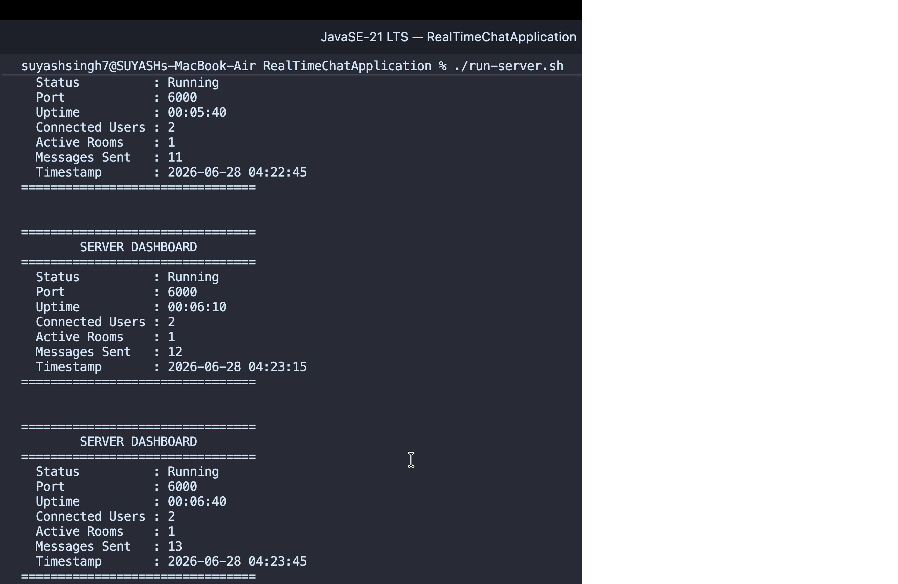
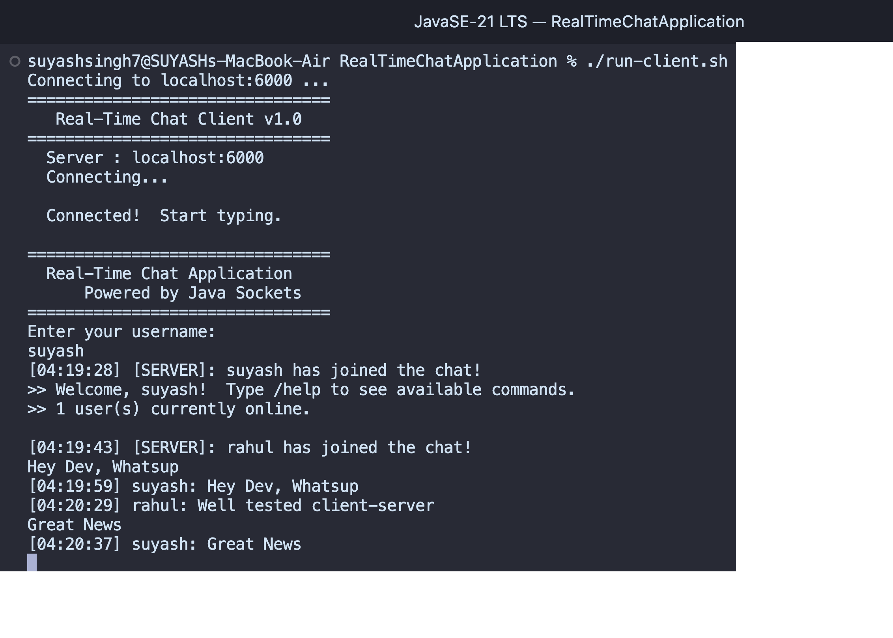
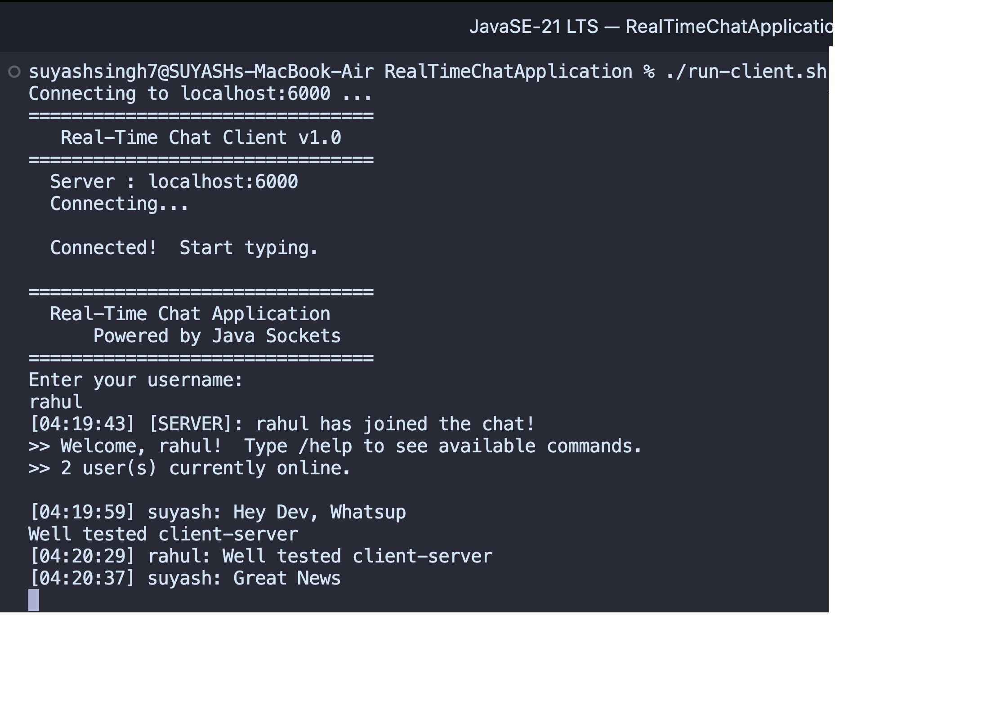
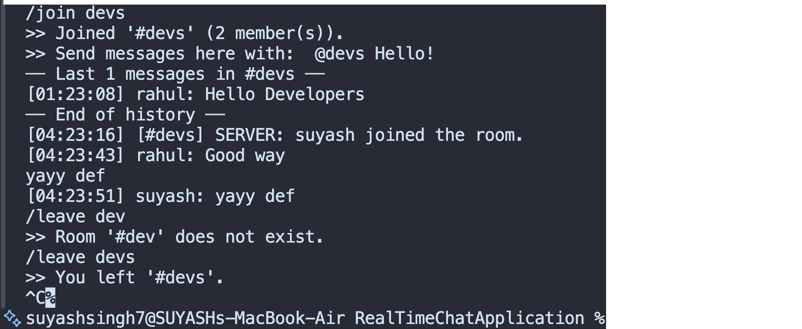

# Real-Time Multi-Client Chat Application

A fully-featured, production-quality **Java socket-based chat system** demonstrating
core Computer Science fundamentals: networking, multithreading, OOP, collections,
file I/O, exception handling, and clean system design.

---

## Project Overview

This application enables multiple users to communicate simultaneously through a
central server. Clients connect via TCP sockets; each connection is handled on its
own thread. The server manages users, rooms, message history, and logging entirely
without frameworks — pure Java 17+.

---

## Features

| Feature | Details |
|---|---|
| **User Authentication** | Unique usernames, join/leave notifications, online user list |
| **Real-Time Broadcast** | Messages delivered instantly to all connected clients |
| **Private Messaging** | Direct encrypted channel between any two users |
| **Chat Rooms** | Create, join, leave, list rooms; isolated message streams |
| **Chat History** | Persistent per-channel history loaded on room join |
| **Server Dashboard** | Live metrics: users, rooms, messages, uptime |
| **Command System** | 9 built-in commands with validation and usage hints |
| **Structured Logging** | Three dedicated log files: server, chat, errors |
| **Graceful Error Handling** | Never crashes on bad input; descriptive feedback to user |

---

## 💻 Technologies Used

- **Programming Language:** Java 17+
- **Networking:** TCP/IP Socket Programming (`ServerSocket`, `Socket`)
- **Concurrency:** Multithreading, `ExecutorService`, `ConcurrentHashMap`, `CopyOnWriteArraySet`, `AtomicLong`
- **Collections Framework:** `Map`, `List`, `Set`
- **File Handling:** `BufferedReader`, `BufferedWriter`, `PrintWriter`, `FileWriter`
- **Core Java Concepts:** OOP, Exception Handling, Serialization
- **Architecture:** Client–Server Architecture
- **Design Patterns:** Factory Method, Strategy Pattern
- **Build:** `javac`, `java`

---

## Project Structure

```
RealTimeChatApplication/
│
├── src/
│   ├── client/
│   │   ├── ChatClient.java       # Entry point; manages connection lifecycle
│   │   ├── ClientReader.java     # Thread: receives & prints server messages
│   │   └── ClientWriter.java     # Thread: reads keyboard input, sends to server
│   │
│   ├── server/
│   │   ├── ChatServer.java       # Entry point; accept loop + thread pool
│   │   ├── ClientHandler.java    # Per-client thread: auth, routing, commands
│   │   └── ServerDashboard.java  # Periodic status printer
│   │
│   ├── model/
│   │   ├── User.java             # Represents a connected user
│   │   ├── Message.java          # Immutable message value object
│   │   └── ChatRoom.java         # Room state: members + message cache
│   │
│   ├── service/
│   │   ├── AuthenticationService.java  # User registration & online tracking
│   │   ├── ChatService.java            # Message factory + counter
│   │   ├── RoomService.java            # Room lifecycle management
│   │   └── HistoryService.java         # File-backed chat persistence
│   │
│   └── util/
│       ├── Constants.java        # All magic values in one place
│       ├── DateUtil.java         # Consistent timestamp formatting
│       └── LoggerUtil.java       # Thread-safe file logger (3 channels)
│
├── data/
│   ├── history/                  # general.txt + pm_A_B.txt files
│   ├── rooms/                    # <roomName>.txt per room
│   └── users/                    # reserved for future persistence
│
├── logs/                         # Generated automatically at runtime
│   ├── server.log
│   ├── chat.log
│   └── errors.log
│
├── screenshots/ # Project screenshots
├── out/                          # compiled .class files                       
├── README.md
├── DOCUMENTATION.md
├── .gitignore 
├── build.sh                 # Build script for macOS/Linux
├── build.bat                # Build script for Windows
├── run-server.sh            # Starts the chat server
└── run-client.sh            # Starts the chat client
```

---

## 🚀 Installation & Build

### Prerequisites

- Java Development Kit (JDK) 17 or later
- Terminal / Command Prompt

### Clone the Repository

```bash
git clone https://github.com/suyashsingh7cse/Real-Time-Multi-Client-Chat-Application.git
cd Real-Time-Multi-Client-Chat-Application
```

### Build the Project

#### macOS / Linux

```bash
chmod +x build.sh
./build.sh
```

#### Windows

```cmd
build.bat
```

---

## ▶️ Running the Application

### Start the Server

#### macOS / Linux

```bash
./run-server.sh
```

Or start on a custom port:

```bash
java -cp out server.ChatServer 6000
```

#### Windows

```cmd
java -cp out server.ChatServer
```

---

### Start the Client

Open a new terminal for each client.

#### macOS / Linux

```bash
./run-client.sh
```

Or connect to a custom server:

```bash
java -cp out client.ChatClient localhost 6000
```

#### Windows

```cmd
java -cp out client.ChatClient
```

---

### Expected Server Output

```text
================================
   Real-Time Chat Server v1.0
================================
  Port    : 6000
  Status  : Starting...
================================
  Waiting for connections...
```

---

## 📖 Command Reference

| Command | Description | Example |
|---------|-------------|---------|
| `/help` | Show all available commands | `/help` |
| `/users` | Display online users | `/users` |
| `/rooms` | List all active chat rooms | `/rooms` |
| `/msg <user> <message>` | Send a private message | `/msg Raj Hello!` |
| `/create <room>` | Create a new chat room | `/create devs` |
| `/join <room>` | Join an existing room | `/join devs` |
| `/leave <room>` | Leave the current room | `/leave devs` |
| `/history` | View general chat history | `/history` |
| `/history <room>` | View room chat history | `/history devs` |
| `/history <user>` | View private chat history | `/history Alice` |
| `/quit` | Disconnect from the server | `/quit` |
| `@<room> <message>` | Send a message to a room | `@devs Hello Team!` |

## 💬 Sample Session

### Terminal 1 – Server

```text
================================
   Real-Time Chat Server v1.0
================================
  Port    : 6000
  Status  : Starting...
================================
  Waiting for connections...

[SERVER] Incoming connection from 127.0.0.1
[SERVER] Registered user: suyash
[SERVER] Authenticated: suyash
[SERVER] Registered user: rahul
[SERVER] Authenticated: rahul
[SERVER] Room created: #devs by rahul
[SERVER] rahul joined #devs
```

### Terminal 2 – Client (Suyash)

```text
================================
  Real-Time Chat Application
      Powered by Java Sockets
================================

Enter your username:
suyash

>> Welcome, suyash! Type /help to see available commands.

[SERVER]: rahul has joined the chat!

whats up
[01:21:38] suyash: whats up

/users

================================
  Online Users (2)
================================
  rahul
  suyash ← you
================================

/msg rahul Hello Rahul!
```

### Terminal 3 – Client (Rahul)

```text
================================
  Real-Time Chat Application
      Powered by Java Sockets
================================

Enter your username:
rahul

>> Welcome, rahul! Type /help to see available commands.

Hello everyone!
[01:21:29] rahul: Hello everyone!

/create devs
>> Room '#devs' created and joined.

@devs Hello Developers
[01:23:08] [#devs] rahul: Hello Developers
```

## 📸 Screenshots

### 🖥️ Server Dashboard

Real-time server dashboard displaying server status, connected users, active rooms, uptime, and message statistics.

<p align="center">
  
</p>

---

### 💻 Client 1 (Suyash)

Client interface showing user authentication and real-time messaging.

<p align="center">
  
</p>

---

### 💻 Client 2 (Rahul)

Second client connected to the server, demonstrating simultaneous multi-client communication.

<p align="center">
  
</p>

---

### 👥 Chat Room

Creating, joining, and communicating within a dedicated chat room.

<p align="center">
  
</p>

---

## 🎓 Learning Outcomes

This project demonstrates practical experience with:

1. **Java Socket Programming** – TCP client-server model, stream I/O over sockets
2. **Multithreading** – Thread pools, daemon threads, concurrent data structures
3. **Object-Oriented Design** – SOLID principles, separation of concerns, dependency injection
4. **Collections Framework** – `ConcurrentHashMap`, `CopyOnWriteArraySet`, `AtomicLong`
5. **File Handling & Serialization** – Persistent chat history, structured log files
6. **Exception Handling** – Defensive programming, graceful degradation
7. **System Design** – Multi-layer architecture (model / service / server / client / util)
8. **Design Patterns** – Factory Method, Observer (broadcast), Strategy (message routing)

---

## 🚀 Future Enhancements

- [ ] TLS/SSL encryption for all socket communication
- [ ] Password-based authentication with bcrypt hashing
- [ ] JavaFX graphical user interface
- [ ] File transfer between users
- [ ] Message reactions and read receipts
- [ ] REST API gateway for web clients
- [ ] Docker containerisation of the server
- [ ] Unit and integration test suite (JUnit 5)
- [ ] Room moderation (kick, ban, moderator roles)
- [ ] Message search across history files

---

<div align="center">

**Built with ❤️ using Java 17**

**Java • Socket Programming • Multithreading • Client–Server Architecture**

©️ 2026 Suyash Singh. All Rights Reserved.

</div>
